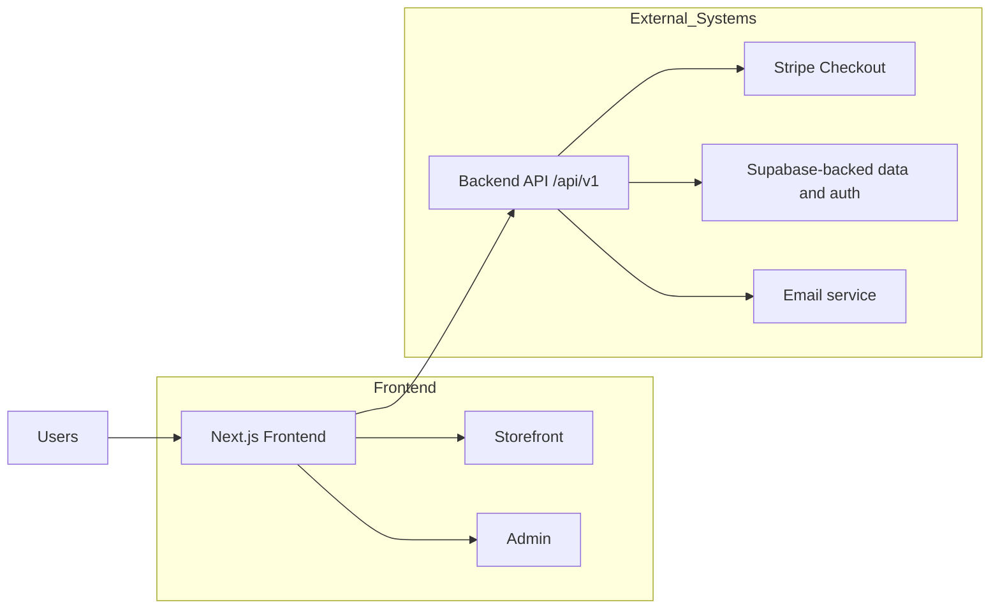
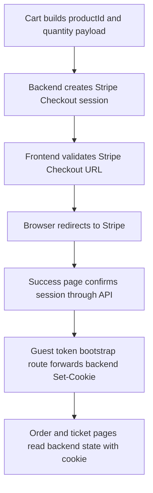
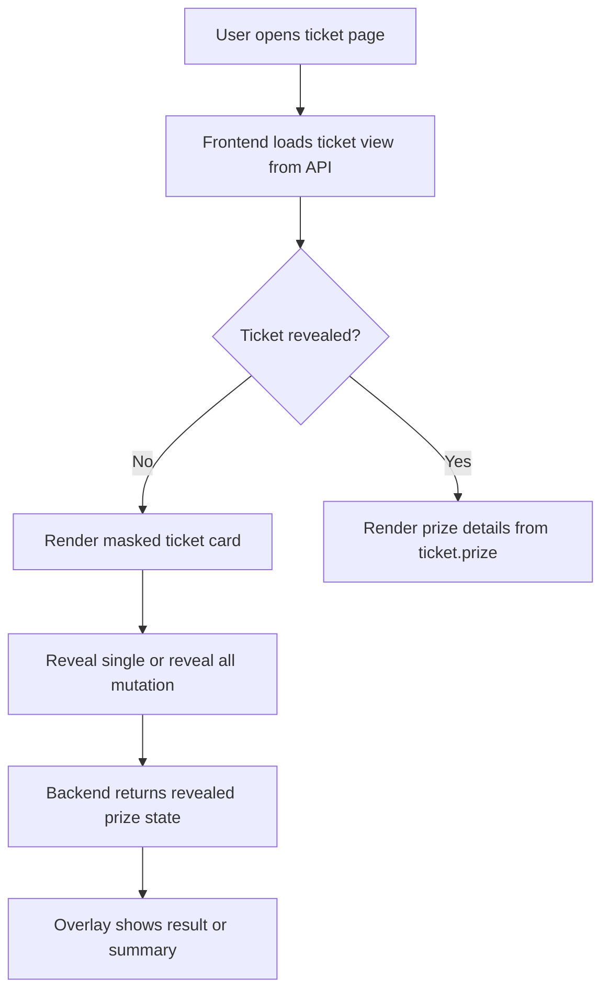
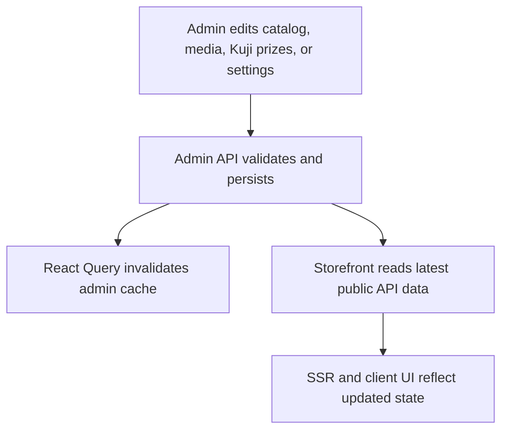

# PopBox Studio — Next.js Frontend

Production-oriented Next.js App Router frontend for a single-vendor anime merchandise and Ichiban Kuji storefront. The app
renders the public storefront, guest order/ticket flows, and an authenticated admin UI while consuming a separate
`/api/v1` backend for inventory, checkout, orders, and persistence.

For deeper interview notes, see [docs/interview-prep.md](docs/interview-prep.md).

---

## Project Summary

PopBox Studio demonstrates frontend engineering for a real commerce surface:

- **SSR-first storefront** for homepage, listings, collections, product detail pages, legal/content pages, and SEO-critical
  routes.
- **Interactive client islands** for cart, wishlist, checkout handoff, search/autocomplete, drawers, admin CRUD, and Kuji
  ticket reveal.
- **Backend-owned commerce truth** for pricing, inventory, order state, Stripe Checkout, Kuji ticket allocation, and prize
  reveal results.
- **Cookie-backed guest order access** where a token bootstrap route forwards backend `Set-Cookie` headers and subsequent
  order/ticket reads rely on cookies.
- **Portfolio-ready admin** for products, images, collections, tags, orders, customers, legal content, shipping settings,
  and store banner settings.

No production live-site URL is declared in this repository. Local and deployment URLs are configured through environment
variables.

---

## Tech Stack

| Area | Choices |
| --- | --- |
| Framework | Next.js App Router, React 19 |
| Language | TypeScript |
| Styling | Tailwind CSS v4, shadcn-style primitives, Radix UI, CVA, `tailwind-merge` |
| Server/client data | Axios, TanStack Query, centralized query/mutation configs |
| Client state | Zustand persisted cart and wishlist stores |
| Forms/validation | React Hook Form, Zod, local validation helpers |
| Auth/admin | Supabase client session handling, Bearer auth headers for admin API calls |
| Payments | Stripe Checkout handoff through backend API responses |
| Observability | Sentry, Vercel Analytics, Vercel Speed Insights |
| Testing | Vitest, Testing Library, MSW |

Runtime: Node.js **24.x**.

---

## Key Frontend Capabilities

**Customer storefront**

- Homepage, products, search, collections, product detail pages, cart, checkout success, about/contact/FAQ/legal pages.
- Standard and Kuji product display with inventory-aware UI.
- Guest order detail and Kuji ticket pages protected by backend-issued cookie sessions.
- Kuji single-ticket and reveal-all flows with video overlay, waiting state, summary state, and backend-sourced prize data.

**Admin workflows**

- Supabase session gate for `/admin`.
- Product create/edit, inventory update, media upload/delete/reorder, Kuji prize management, collection/tag management.
- Order list/detail, status updates, shipment updates, refunds, resend confirmation action.
- Customer list, legal/FAQ editor, shipping settings, and storefront banner settings.

**Quality and platform**

- `next/image` with Supabase storage remote patterns and fallback image states.
- Metadata helpers, canonical URLs, dynamic sitemap, robots rules, Product JSON-LD, FAQ JSON-LD, and homepage WebSite
  JSON-LD.
- Loading skeletons, empty/error states, toast feedback, guarded checkout interactions, and responsive layouts.

---

## Architecture Overview

| Layer | Responsibility |
| --- | --- |
| `app/(store)` | Public storefront routes, SEO metadata, guest order pages, Kuji ticket pages |
| `app/(admin)` | Authenticated admin routes and admin-only metadata/noindex behavior |
| Server Components | Default page/rendering layer for initial HTML and server-safe public API reads |
| Client Components | Cart/wishlist state, React Query, forms, drawers, checkout handoff, admin CRUD, Kuji reveal |
| `lib/api/public-storefront.ts` | Server-only Axios reads to the backend for storefront SSR/RSC use cases |
| `configs/api/*` | Client query/mutation request definitions used by React Query hooks |
| Backend API | Separate `/api/v1` service that owns validation, inventory, payments, order state, and Kuji results |



---

## Core Flows

**Checkout and guest order access**



**Ichiban Kuji reveal**



**Admin to storefront**



---

## Local Setup

Requirements: Node.js 24.x and pnpm.

```bash
pnpm install
pnpm dev
```

Dev server: [http://localhost:3001](http://localhost:3001)

For production-style local runs:

```bash
pnpm build
pnpm start
```

---

## Environment Variables

Use `.env.local` locally. `.env.example` shows the required public configuration.

| Variable | Purpose |
| --- | --- |
| `NEXT_PUBLIC_API_BASE_URL` | Backend origin for `/api/v1`; required in production, defaults to `http://localhost:3000` in dev |
| `NEXT_PUBLIC_SITE_URL` | Canonical site URL for metadata and absolute URLs |
| `NEXT_PUBLIC_STRIPE_PUBLISHABLE_KEY` | Stripe publishable key |
| `NEXT_PUBLIC_SUPABASE_URL` | Supabase project URL |
| `NEXT_PUBLIC_SUPABASE_PUBLIC_KEY` | Supabase anon/public key |
| `NEXT_PUBLIC_IS_SITE_OPEN` | Set to `false` for maintenance-style storefront gating |

On Vercel, `VERCEL_PROJECT_PRODUCTION_URL` or `VERCEL_URL` can back `NEXT_PUBLIC_SITE_URL` when it is not explicitly set.

---

## Quality Checks

| Command | Purpose |
| --- | --- |
| `pnpm test` | Vitest unit/component tests |
| `pnpm build` | Production Next.js build |
| `pnpm exec tsc --noEmit` | TypeScript typecheck |
| `pnpm check` | Repo quality command: lint with fixes, tests, and build |

Note: `pnpm lint` is configured as `eslint . --fix`, so inspect diffs after running `pnpm check`.

---

## Folder Structure

```text
app/                 # App Router route groups, layouts, metadata, loading/error boundaries
components/          # UI primitives, storefront, admin, cart, wishlist, Kuji components
configs/             # Public env and API query/mutation configs
hooks/               # React Query wrappers, Zustand stores, checkout/search/mobile hooks
interfaces/          # Shared TypeScript contracts for API payloads
lib/                 # Server-safe API reads, SEO helpers, filters, Sentry, Supabase client
tests/               # Vitest, Testing Library, MSW-backed coverage
public/              # Static images/video used by storefront and Kuji reveal UI
```

---

## Documentation

- [Interview prep guide](docs/interview-prep.md) explains architecture, flows, trade-offs, and common interview answers.
- Backend behavior is described only where the frontend integrates with it; the backend repository remains the source of
  truth for persistence, inventory, payment, email, and webhook implementation details.

---

## License

No `LICENSE` file is present in this repository. Confirm usage with the maintainer before reuse or redistribution.
