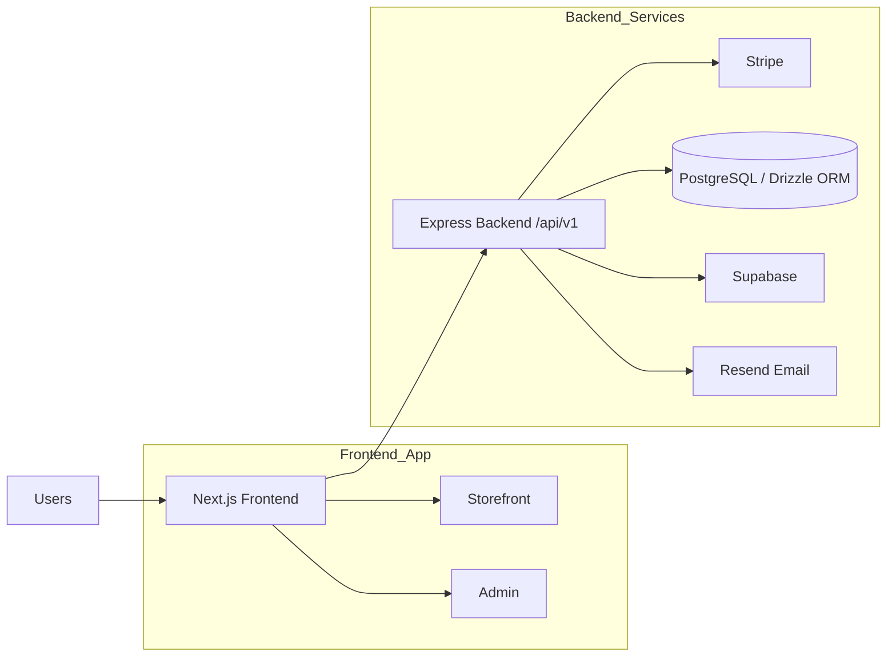
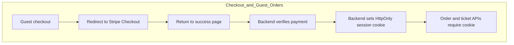
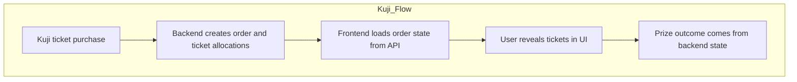
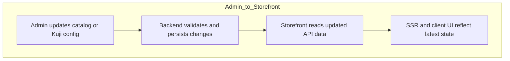

# PopBox Studio — Next.js Frontend

**SSR-first anime e-commerce storefront and admin UI with real checkout, guest orders, and Ichiban Kuji–style ticket and
prize flows—backed by a separate Express `/api/v1` service.**

---

## Highlights

### Why this project matters

This project demonstrates production-grade frontend engineering across SSR commerce, secure session handling, strict API
contract consumption, and real-world checkout flows. It reflects how a modern frontend integrates with backend-owned
business logic without duplicating critical rules such as payments, inventory, and order state.

- **SSR-first storefront** — Server-rendered discovery, PDP, collections, and SEO-critical surfaces; client islands for
  cart, checkout handoff, and interactive admin.
- **Cookie-backed guest orders** — Access token hits a bootstrap route; the backend sets an **HttpOnly** session cookie;
  order and ticket APIs **require that cookie** (no long-lived token in client storage as a substitute).
- **Strict API consumption** — Typed boundaries, Axios + TanStack Query, and **`QueryConfigs`-style** request
  definitions; **no raw `fetch` in the client data layer** (per repo conventions).
- **Kuji in the UI** — Ticket purchase and prize reveal experiences (e.g. `components/kuji/`, Kuji-aware product
  surfaces) without re-implementing inventory or draw rules on the frontend.
- **Stripe Checkout, server-owned truth** — Browser redirects to Stripe; success and order state are confirmed through
  the API, not assumed on the client alone.
- **Unified storefront + admin architecture** — `app/(store)` and `app/(admin)` route groups share components and design
  tokens while
  keeping concerns separated.

---

## Overview

PopBox Studio sells standard anime merchandise and **Ichiban Kuji–style** lottery products. This repository is the
**Next.js App Router frontend**: it renders the public site and staff admin, and calls a **versioned REST API** on
another origin.

The backend owns validation, inventory, payments, webhooks, and persistence. The frontend focuses on **presentation and
orchestration, with strict separation from backend business logic, clear server/client boundaries, and safe flows that
reflect real production auth and http-only cookie-based session handling**.

---

## Tech stack

| Area               | Choices                                                                              |
|--------------------|--------------------------------------------------------------------------------------|
| Framework          | Next.js (App Router), React 19                                                       |
| Language           | TypeScript (strict)                                                                  |
| Styling            | Tailwind CSS v4, shadcn-style primitives (Radix, CVA, `tailwind-merge`)              |
| Client data        | TanStack Query + **Axios**; centralized request config                               |
| Forms / validation | React Hook Form, Zod                                                                 |
| Auth integration   | Supabase client libraries where the API/auth design requires them                    |
| Payments (client)  | Stripe.js / Stripe.js (Checkout redirect and client-side integration where required) |
| Theming            | `next-themes` Light-only design system (premium storefront direction)                |
| Tooling            | pnpm, ESLint (`eslint-config-next`), Vitest + Testing Library + MSW                  |

**Runtime:** Node.js **24.x** (`package.json` `engines`).

---

## Features

**Customer-facing**

- Homepage, collections, product listing, PDP, search
- Cart, Stripe Checkout redirect, checkout success handling
- Guest order lookup: token bootstrap → cookie session → order detail and **Kuji ticket / reveal** views
- Supporting pages: about, contact, legal/FAQ
- SEO: metadata, sitemap, robots, Open Graph

**System / engineering**

- Server-safe reads for public storefront data (e.g. `lib/api/public-storefront.ts` → `/api/v1/...`)
- Client mutations and interactive data via shared Axios client and query hooks
- Admin: catalog, orders, customers, collections, tags, legal content (`app/(admin)/admin/...`)
- Feature-oriented components under `components/storefront`, `components/admin`, `components/kuji`, etc.

---

## Architecture

| Layer                 | Responsibility                                                                                                                   |
|-----------------------|----------------------------------------------------------------------------------------------------------------------------------|
| **Route groups**      | `(store)` = public site; `(admin)` = staff tools. Same deployable app, different layouts and guards.                             |
| **Server Components** | Default. Own initial HTML, SEO, and server-side data reads where the module is server-safe.                                      |
| **Client Components** | Hooks, React Query, forms, cart/checkout UX, admin interactivity.                                                                |
| **Server-safe API**   | Modules such as `lib/api/public-storefront.ts` call `/api/v1` during SSR or RSC without browser-only APIs.                       |
| **Client API layer**  | `configs/api/query-config.ts` (and related) + `httpClient()` + `useCustomizeQuery` / mutations—**no raw `fetch`** in that layer. |
| **Backend**           | Separate Express service: `/api/v1`, domain modules, Zod, Stripe, Supabase, Resend, etc.                                         |

---

## System overview



---

## Key flows

- **Guest checkout → order access**
    - User completes Stripe Checkout
    - Redirect to success page
    - Backend verifies payment and sets HttpOnly session cookie
    - Subsequent order and ticket requests require cookie (no token fallback)



- **Ichiban Kuji purchase → ticket reveal**
    - User purchases Kuji tickets
    - Order stores ticket allocations
    - Frontend renders reveal flows based on backend state
    - No prize logic is computed on the client



- **Admin → catalog → storefront**
    - Admin updates products, inventory, or Kuji configuration
    - Backend persists and enforces rules
    - Storefront reflects changes via API-driven SSR + client updates



---

## Key engineering decisions

- **SSR-first for commerce SEO** — Category, product, and collection URLs are meaningful to crawlers and first paint;
  hydration cost is pushed to interactive shells.
- **Backend as source of truth** — Stock, pricing eligibility, payment completion, and order/ticket state come from the
  API; the UI reflects responses and error shapes instead of guessing outcomes after Stripe redirect.
- **HttpOnly session for guest orders** — A one-time access path establishes a server session; subsequent order/ticket
  calls rely on **cookies**, reducing exposure of long-lived secrets in JS-accessible storage and matching how the API
  enforces access.
- **No business logic smuggling** — Types and UI states align with the API contract; the frontend does not re-implement
  Kuji draw rules, inventory decrements, or webhook semantics.
- **Centralized HTTP** — One Axios configuration (base URL, interceptors) keeps behavior consistent between admin and
  storefront clients.
- **Strict TypeScript + Zod** — Compile-time safety at boundaries; runtime validation where user input hits the wire.
- **Design system cohesion** — Shared UI primitives keep storefront and admin visually and behaviorally aligned without
  copy-pasting patterns.

---

## Getting started

**Requirements:** Node.js 24.x, pnpm.

```bash
pnpm install
pnpm dev
```

Dev server: **[http://localhost:3001](http://localhost:3001)** (`next dev -p 3001`).

```bash
pnpm build && pnpm start
```

---

## Environment variables

| Variable                                       | Scope       | Purpose                                                                                    |
|------------------------------------------------|-------------|--------------------------------------------------------------------------------------------|
| `NEXT_PUBLIC_API_BASE_URL`                     | Public      | Backend origin for `/api/v1` (required in production; dev default `http://localhost:3000`) |
| `NEXT_PUBLIC_SITE_URL`                         | Public      | Canonical site URL for metadata and absolute URLs                                          |
| `NEXT_PUBLIC_STRIPE_PUBLISHABLE_KEY`           | Public      | Stripe.js                                                                                  |
| `NEXT_PUBLIC_SUPABASE_URL`                     | Public      | Supabase project URL                                                                       |
| `NEXT_PUBLIC_SUPABASE_PUBLISHABLE_DEFAULT_KEY` | Public      | Supabase anon/public key                                                                   |
| `NEXT_PUBLIC_IS_SITE_OPEN`                     | Public      | Set to `false` for maintenance-style behavior (default: open)                              |
| `STRIPE_SECRET_KEY`                            | Server only | Stripe server SDK                                                                          |

On Vercel, `VERCEL_URL` / `VERCEL_PROJECT_PRODUCTION_URL` can back `NEXT_PUBLIC_SITE_URL` when unset—see
`configs/public-env.ts`.

Use `.env.local` locally (gitignored).

---

## Scripts

| Command         | Description                 |
|-----------------|-----------------------------|
| `pnpm dev`      | Dev server on port **3001** |
| `pnpm build`    | Production build            |
| `pnpm start`    | Production server           |
| `pnpm lint`     | ESLint                      |
| `pnpm lint:fix` | ESLint with fixes           |
| `pnpm check`    | Lint + build                |
| `pnpm test`     | Vitest                      |

---

## API overview

- **Contract:** REST under **`/api/v1`** on `NEXT_PUBLIC_API_BASE_URL`.
- **This app:** Consumer only—OpenAPI / backend repo is authoritative.
- **Examples:** `lib/api/public-storefront.ts` and `configs/api/query-config.ts` (home, products, collections, search,
  checkout success, orders, tickets, legal, etc.).

---

## Folder structure (high level)

```text
app/                 # App Router: (store), (admin), layouts, metadata
components/          # UI, layout, storefront, admin, kuji
configs/             # Env (public + server-only), API query/mutation configs
hooks/               # React Query helpers and app hooks
lib/                 # API helpers, SEO, utilities
interfaces/          # Shared TypeScript types
public/              # Static assets
tests/               # Vitest
```

---

## Roadmap / future improvements

- Broader E2E coverage for checkout, guest order cookie flows, and Kuji ticket paths against a staging API
- Documented performance and image/CDN defaults per environment
- Accessibility and i18n expansion as product scope grows

---

## Further reading

- [Next.js Documentation](https://nextjs.org/docs)
- [Learn Next.js](https://nextjs.org/learn)
- [Deploying Next.js](https://nextjs.org/docs/app/building-your-application/deploying)

---

## License

No `LICENSE` file is present in this repository. Confirm usage with the maintainers before reuse or redistribution.
